# 超市收银库存管理系统 — 用户手册

## 目录

- [系统简介](#系统简介)
- [安装与启动](#安装与启动)
- [登录系统](#登录系统)
- [主窗口与导航](#主窗口与导航)
- [收银（核心功能）](#收银核心功能)
  - [添加商品到购物车](#添加商品到购物车)
  - [管理购物车](#管理购物车)
  - [整单折扣](#整单折扣)
  - [库存校验与忽略库存模式](#库存校验与忽略库存模式)
  - [结账](#结账)
  - [快捷键](#快捷键)
- [销售记录](#销售记录)
- [仪表盘（管理员）](#仪表盘管理员)
- [商品管理（管理员）](#商品管理管理员)
- [商品分类（管理员）](#商品分类管理员)
- [进货管理（管理员）](#进货管理管理员)
- [用户管理（管理员）](#用户管理管理员)
- [支付设置（管理员）](#支付设置管理员)
- [备份管理（管理员）](#备份管理管理员)
- [个人中心](#个人中心)
- [权限说明](#权限说明)
- [快捷键速查表](#快捷键速查表)
- [常见使用场景](#常见使用场景)
- [常见问题与排查](#常见问题与排查)
- [技术参数](#技术参数)


## 系统简介

本系统是一套专为中小型超市、便利店设计的**收银与库存管理系统**，基于 PyQt5 桌面框架开发，采用现代化的 Fluent Design 风格界面。

**核心功能包括：**

- **扫码收银**：支持 USB 条码扫码枪即扫即录，快速结账
- **商品管理**：支持条码、名称、分类、进售价、库存等完整商品信息维护
- **进货管理**：扫码入库，自动更新库存和进价
- **用户管理**：管理员 / 店员角色分离，权限隔离
- **数据统计**：仪表盘实时展示营业数据、图表、排行
- **销售记录**：完整的交易历史查询与详情查看
- **支付方式**：支持现金、微信支付、支付宝三种收款方式
- **数据备份**：每日定时自动备份 + 手动备份 + 导入导出

**系统采用本地 SQLite 数据库存储数据，无需联网即可使用，适合单机或小规模门店部署。**


## 安装与启动

### 方式一：直接运行（推荐开发者）

确保已安装 Python 3.8 及以上版本，并安装依赖：

```bash
pip install PyQt5==5.15.11 PyQt-Fluent-Widgets==1.11.1
```

启动程序：

```bash
python main.py
```

### 方式二：使用预编译版本

前往 [GitHub Releases](https://github.com/zhiqing0205/pos-pyqt/releases) 下载对应平台的安装包：

| 平台 | 文件 | 说明 |
|------|------|------|
| Windows (x64) | `pos-pyqt-windows-x64-版本号-setup.exe` | 安装程序，推荐使用 |
| Windows (x64) | `pos-pyqt-windows-x64-版本号-portable.zip` | 免安装便携版，解压即用 |
| macOS (ARM64) | `pos-pyqt-macos-arm64-版本号.dmg` | macOS 磁盘映像 |
| Linux (x64) | `pos-pyqt-linux-x64-版本号.tar.gz` | Linux 压缩包，解压后运行 |

### 首次启动

系统首次启动时会自动完成以下初始化：

1. 创建数据库文件 `app/data/pos.db`
2. 创建备份目录 `app/data/backups/`
3. 初始化数据库表结构
4. 创建默认管理员账户（用户名 `admin`，密码 `admin123`）
5. 创建 2 个演示店员账户（张店员 / 李店员，密码 `123456`）
6. 导入 26 种预设商品数据（涵盖饮料、水、奶品、酒、方便面、零食、日用品 7 个分类）
7. 生成近 7 天的演示交易和进货记录


## 登录系统

启动程序后首先进入登录界面。

<figure>
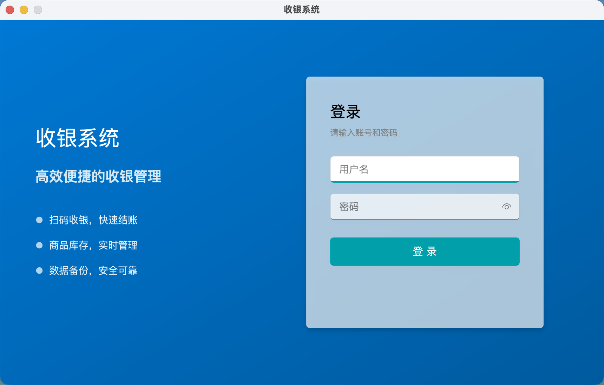
<figcaption>图：登录界面</figcaption>
</figure>

### 登录步骤

1. 在「用户名」输入框中输入账号
2. 在「密码」输入框中输入密码
3. 点击「登录」按钮，或直接按 **Enter** 键

### 默认账户

| 用户名 | 密码 | 角色 |
|--------|------|------|
| admin | admin123 | 管理员 |
| 张店员 | 123456 | 店员 |
| 李店员 | 123456 | 店员 |

> **安全提示**：首次登录后建议立即修改默认密码，或在用户管理中新建管理员账号后禁用默认账号。

### 登录失败

如果用户名或密码错误，界面顶部会弹出红色错误提示，密码框会自动清空以便重新输入。


## 主窗口与导航

登录成功后进入主窗口。窗口标题栏显示「收银系统 - 用户名 (角色)」。左侧为导航菜单，根据当前用户的角色显示不同的菜单项。

<figure>
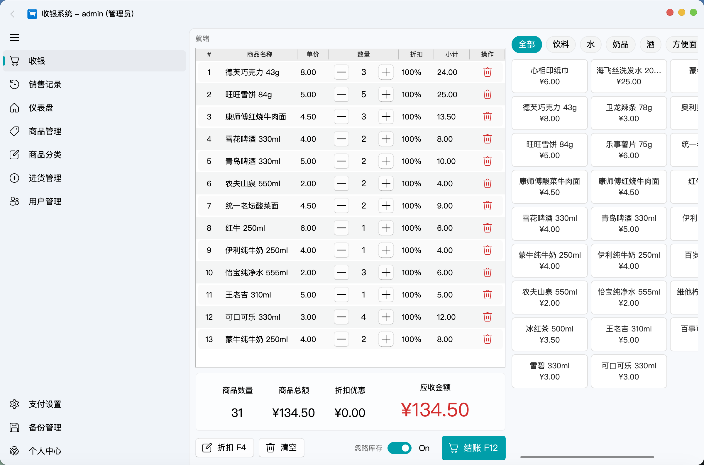
<figcaption>图：主窗口（管理员视角）</figcaption>
</figure>

### 管理员菜单

| 菜单项 | 位置 | 说明 |
|--------|------|------|
| 收银 | 顶部 | 核心收银操作界面 |
| 销售记录 | 顶部 | 查看历史交易 |
| 仪表盘 | 顶部 | 数据统计与分析 |
| 商品管理 | 顶部 | 商品信息维护 |
| 商品分类 | 顶部 | 管理商品分类与排序 |
| 进货管理 | 顶部 | 扫码入库操作 |
| 用户管理 | 顶部 | 管理系统账号 |
| 支付设置 | 底部 | 配置支付宝/微信 |
| 备份管理 | 底部 | 数据备份与恢复 |
| 个人中心 | 底部 | 查看个人信息、修改密码 |

### 店员菜单

店员可看到「收银」「销售记录」两个菜单，以及底部的「个人中心」。

### 退出系统

关闭窗口时系统会弹出确认对话框：

- 点击「确认」：若在备份设置中启用了"关闭程序前自动备份"，系统会先执行一次备份，然后退出
- 点击「取消」：返回程序继续使用


## 收银（核心功能）

收银页面是系统最核心的界面，采用左右分栏布局：

- **左侧**：购物车列表 + 订单汇总 + 操作按钮
- **右侧**：商品分类标签 + 商品按钮网格

<figure>
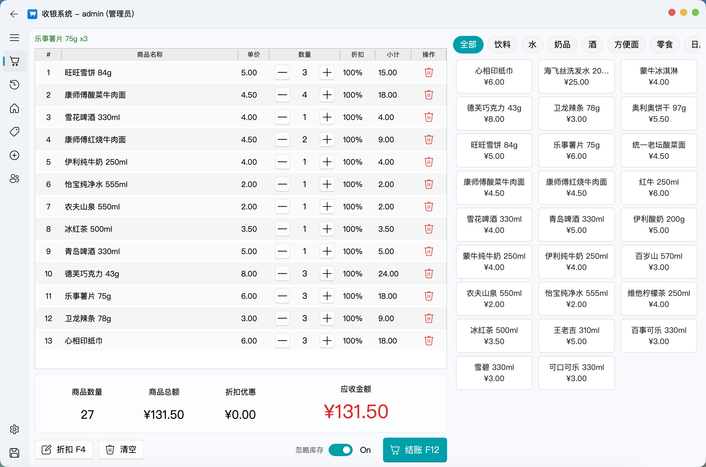
<figcaption>图：收银界面</figcaption>
</figure>


### 添加商品到购物车

有两种方式可将商品添加到购物车：

#### 方式一：条码扫码枪（推荐）

1. 确保焦点不在任何文本输入框中（点击页面空白区域即可）
2. 使用 USB 条码扫码枪扫描商品条码
3. 扫码枪会自动输入条码并按下回车键
4. 系统自动识别商品并加入购物车
5. 若商品已在购物车中，数量自动 +1
6. 若商品不存在，显示红色错误提示

> 扫码枪通过模拟键盘输入工作，系统使用全局事件过滤器捕获输入。连续按键会进入缓冲区，100 毫秒无新输入后自动清空。

#### 方式二：点击商品按钮

1. 在右侧面板中选择商品分类（如「饮料」「零食」等），或选择「全部」查看所有商品。分类标签的显示顺序由「商品分类」页面中的排序值决定
2. 点击对应的商品按钮
3. 商品自动加入购物车，若已存在则数量 +1

<figure>
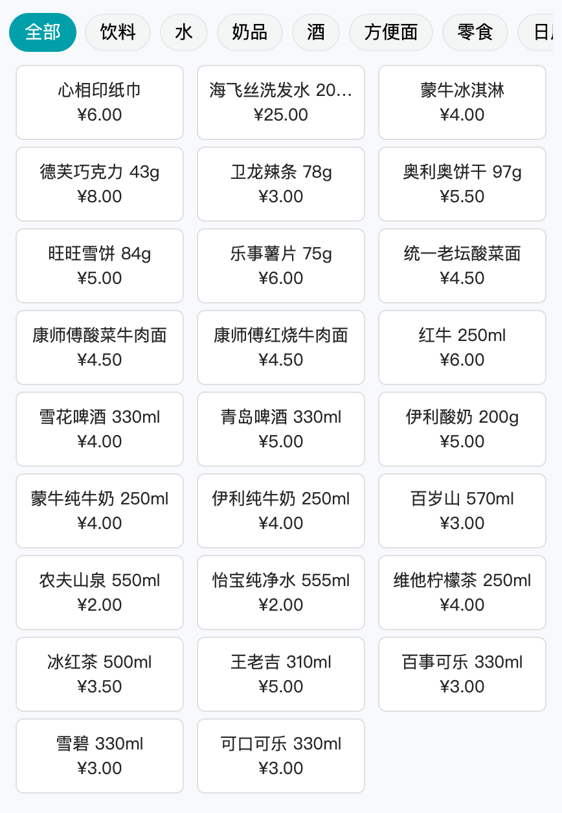
<figcaption>图：右侧商品分类与按钮区域</figcaption>
</figure>


### 管理购物车

购物车表格显示以下列：

| 列名 | 说明 |
|------|------|
| # | 商品序号 |
| 商品名称 | 商品名称 |
| 单价 | 商品售价 |
| 数量 | 当前购买数量，可通过 ＋/－ 按钮调整 |
| 折扣 | 单品折扣率，如「85%」表示 85 折 |
| 小计 | 单价 × 数量 × 折扣率 |
| 操作 | 删除按钮 |

#### 调整数量

- 点击行右侧的 **＋** 按钮增加数量
- 点击 **－** 按钮减少数量（减至 0 时自动删除该商品）

#### 双击编辑

双击购物车中的任意商品行，弹出编辑对话框，可执行以下操作：

- **修改数量**：通过数值输入框精确设置购买数量
- **修改折扣**：输入折扣百分比（如输入 85 表示 85 折）
- **删除商品**：点击红色「删除此商品」按钮

<figure>
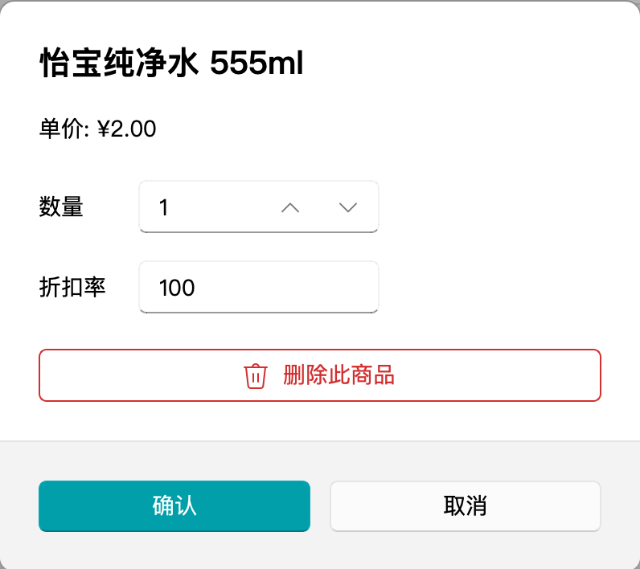
<figcaption>图：购物车商品编辑对话框</figcaption>
</figure>

#### 删除商品

- 选中表格行后按 **Delete** 键删除
- 或点击操作列的删除按钮
- 或双击商品后在弹窗中删除

#### 清空购物车

点击操作栏的「清空」按钮可一次性清空所有商品。


### 整单折扣

按 **F4** 或点击「折扣」按钮打开整单折扣对话框。

- 输入折扣百分比，例如输入 **85** 表示全单打 **85 折**（即总价 × 0.85）
- 折扣应用后，下方的「折扣优惠」和「应收金额」会实时更新
- 整单折扣与单品折扣叠加计算

<figure>
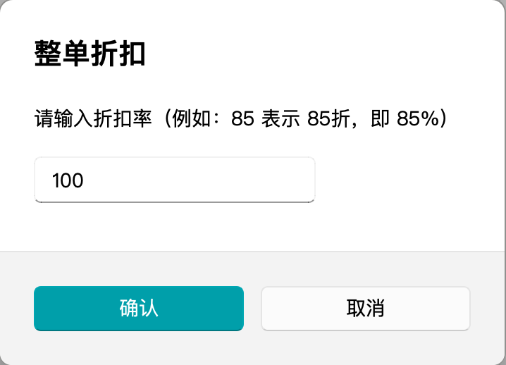
<figcaption>图：整单折扣对话框</figcaption>
</figure>


### 库存校验与忽略库存模式

操作栏上有一个**「忽略库存」切换开关**，默认为**开启状态**。

| 模式 | 库存不足时的行为 |
|------|------------------|
| 忽略库存 **开启**（默认） | 显示黄色警告提示，但**不阻止**操作。可继续增加数量和结账 |
| 忽略库存 **关闭** | 显示红色错误提示，**阻止**增加数量和结账 |

库存校验发生在以下时机：

- 添加商品到购物车时
- 点击 ＋ 按钮增加数量时
- 双击修改数量时
- 点击结账时（逐一检查所有商品）


### 结账

购物车中有商品后，按 **F12** 或点击「结账」按钮打开结账对话框。

<figure>
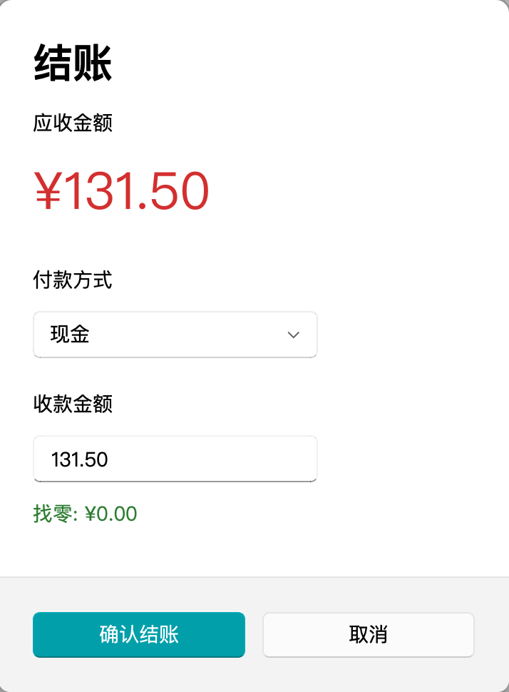
<figcaption>图：结账对话框</figcaption>
</figure>

#### 结账步骤

1. 确认页面顶部显示的**应收金额**（红色大字）
2. 选择**付款方式**：
   - **现金**：输入收款金额，系统自动计算找零
   - **支付宝**：可选填支付凭证号（需先在「支付设置」中配置支付宝参数后才会显示）
   - **微信支付**：可选填支付凭证号（需先在「支付设置」中配置微信支付参数后才会显示）
3. 点击「确认结账」完成交易

> 现金支付始终可用。支付宝和微信支付需管理员在「支付设置」页面填写全部配置字段并保存后，结账时才会出现对应选项。详见[支付设置](#支付设置管理员)章节。

#### 结账完成后

- 系统自动生成交易单号（格式 `TXN` + 时间戳）
- 交易记录和商品明细写入数据库
- 自动扣减相关商品库存
- 购物车清空，折扣率重置
- 界面顶部显示绿色「交易完成」提示


### 快捷键

| 快捷键 | 功能 |
|--------|------|
| **F12** | 结账 |
| **F4** | 整单折扣 |
| **Delete** | 删除选中的购物车商品 |
| **条码 + Enter** | 扫码添加商品（全局监听） |


## 销售记录

销售记录页面展示所有历史交易，**管理员和店员均可查看**。

<figure>
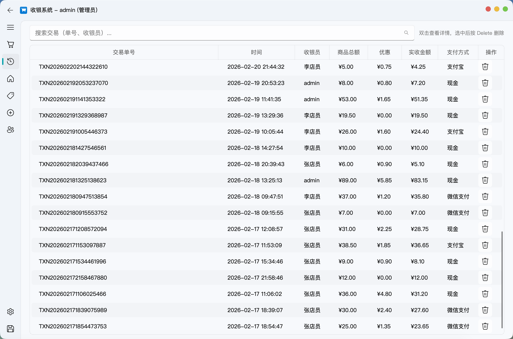
<figcaption>图：销售记录列表</figcaption>
</figure>

### 交易列表

列表默认显示最近 200 条交易记录，按时间倒序排列（最新在前）。

| 列名 | 说明 |
|------|------|
| 交易单号 | 唯一交易编号，格式 `TXN` + 时间戳 |
| 时间 | 交易完成的时间 |
| 收银员 | 操作该笔交易的用户 |
| 商品总额 | 所有商品原价合计 |
| 优惠 | 折扣减免金额 |
| 实收金额 | 实际收取的金额 |
| 支付方式 | 现金 / 微信支付 / 支付宝 |

### 搜索

在顶部搜索框输入关键词后按 Enter，可按交易单号或收银员名字进行模糊搜索。清空搜索框后自动恢复显示全部记录。

### 查看交易详情

**双击**任意一笔交易，弹出详情对话框，展示：

- 交易基本信息（单号、时间、收银员、支付方式）
- 金额汇总（商品总额、折扣优惠、实收金额）
- 商品明细表格（商品名、单价、数量、折扣率、小计）

<figure>
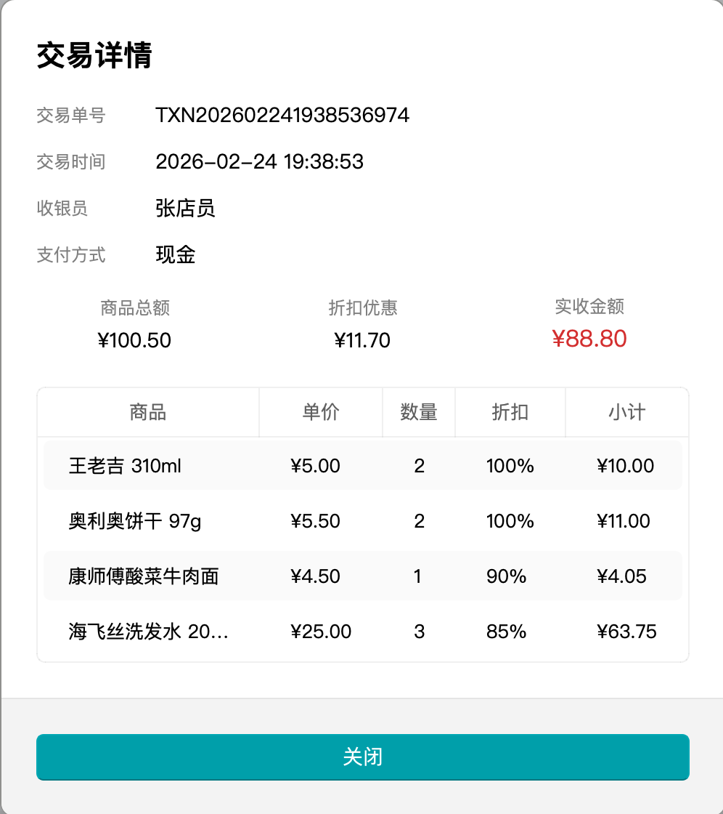
<figcaption>图：交易详情对话框</figcaption>
</figure>

### 删除交易

点击每行右侧的删除按钮，或选中后按 **Delete** 键，确认后即可删除该笔交易及其商品明细。


## 仪表盘（管理员）

仪表盘页面以卡片和图表的形式直观展示业务数据，仅管理员可见。页面内容在每次交易完成、商品变更或库存变更后**自动刷新**。

<figure>
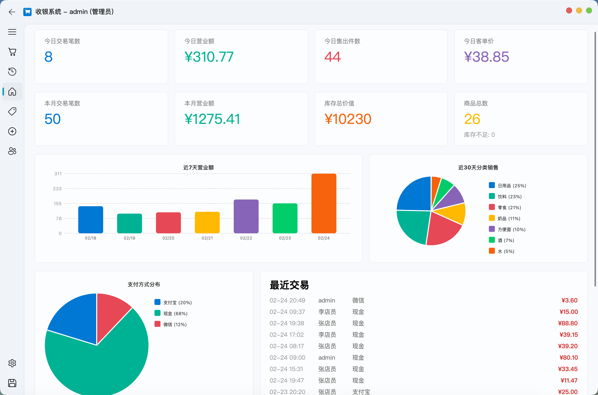
<figcaption>图：仪表盘概览</figcaption>
</figure>

### 第一行：今日数据概览

| 卡片 | 内容 | 颜色 |
|------|------|------|
| 今日交易笔数 | 当天完成的交易总笔数 | 蓝色 |
| 今日营业额 | 当天所有交易的实收金额合计 | 绿色 |
| 今日售出件数 | 当天售出的商品总件数 | 红色 |
| 今日客单价 | 当天平均每笔交易金额 | 紫色 |

### 第二行：本月与库存统计

| 卡片 | 内容 | 颜色 |
|------|------|------|
| 本月交易笔数 | 当月累计交易笔数 | 蓝色 |
| 本月营业额 | 当月累计实收金额 | 绿色 |
| 库存总价值 | 所有商品的 库存数量 × 售价 之和 | 橙色 |
| 商品总数 | 当前活跃商品总数，及库存不足（< 10）的商品数 | 黄色 |

### 第三行：趋势图表

- **近 7 天营业额柱状图**（左侧）：展示最近 7 天每天的营业额变化趋势
- **近 30 天分类销售饼图**（右侧）：展示各商品分类的销售金额占比

<figure>
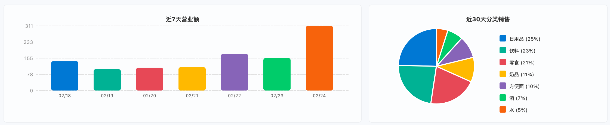
<figcaption>图：营业额柱状图与分类销售饼图</figcaption>
</figure>

### 第四行：支付分布与近期交易

- **支付方式分布饼图**（左侧）：展示近 30 天各支付方式（现金/微信/支付宝）的金额占比
- **最近交易列表**（右侧）：展示最近 10 笔交易的时间、收银员、支付方式和金额

### 第五行：排行与预警

- **热销商品（近 30 天）**（左侧）：按销售件数排序的前 8 名商品，显示销量和销售额
- **库存预警（< 10）**（右侧）：库存不足 10 件的商品列表，库存 ≤ 3 件显示为红色警告，其余为橙色


## 商品管理（管理员）

商品管理页面用于维护商品信息，仅管理员可见。

<figure>
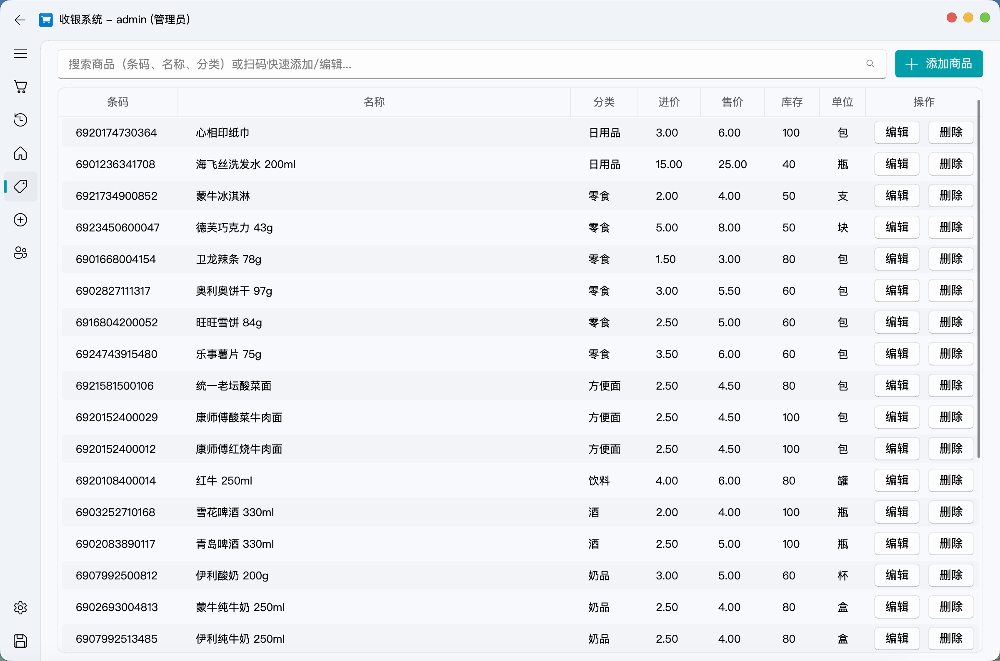
<figcaption>图：商品管理列表</figcaption>
</figure>

### 商品列表

列表展示所有活跃商品，列包括：条码、名称、分类、进价、售价、库存、单位、操作。

### 搜索商品

在搜索框中输入关键词可按条码、名称或分类进行模糊搜索。

### 添加商品

#### 方式一：手动添加

点击「添加商品」按钮，在弹出的对话框中填写：

| 字段 | 是否必填 | 说明 |
|------|----------|------|
| 条码 | 必填 | 商品条码，必须唯一 |
| 名称 | 必填 | 商品名称 |
| 分类 | 选填 | 从下拉列表选择商品分类，默认为「其他」 |
| 进价 | 选填 | 进货价格，默认 0 |
| 售价 | 选填 | 销售价格，默认 0 |
| 库存数量 | 选填 | 初始库存数量，默认 0 |
| 单位 | 选填 | 计量单位，默认「个」 |

#### 方式二：扫码快速添加

在商品管理页面使用扫码枪扫描商品：

- **已有商品**：自动打开该商品的编辑对话框
- **新商品**：自动打开添加对话框，条码自动填入且不可修改

<figure>
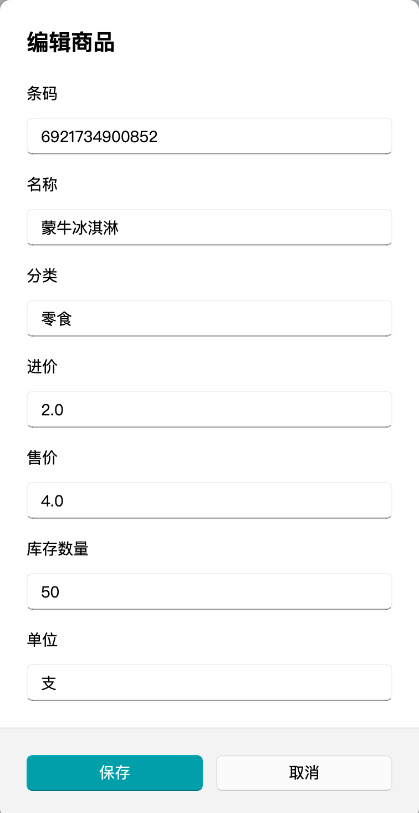
<figcaption>图：添加/编辑商品对话框</figcaption>
</figure>

### 编辑商品

点击表格中的「编辑」按钮，修改商品信息后保存。

### 删除商品

点击表格中的「删除」按钮，确认后**彻底删除**该商品。相关的销售记录和进货记录会被一并删除（级联删除）。


## 商品分类（管理员）

商品分类页面用于管理商品的分类信息和显示排序，仅管理员可见。

<figure>
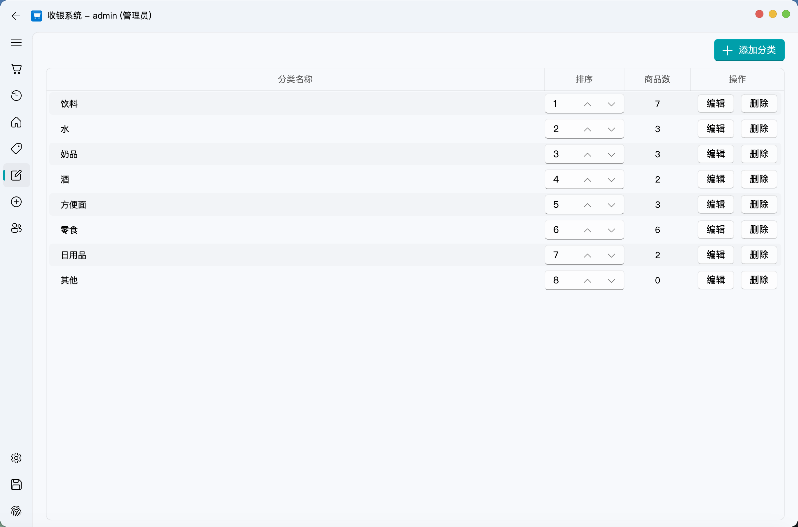
<figcaption>图：商品分类管理界面</figcaption>
</figure>

### 分类列表

列表展示所有分类，列包括：分类名称、排序、商品数、操作。

- **排序**：数字越小越靠前，收银页面右侧的分类标签按此顺序显示
- **商品数**：当前属于该分类的商品数量

### 添加分类

点击「添加分类」按钮，输入分类名称和排序值，保存即可。

<figure>
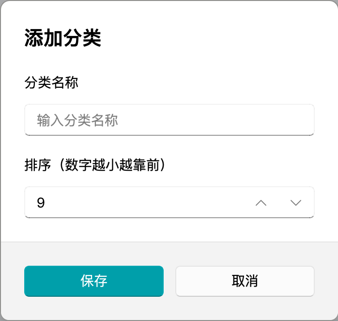
<figcaption>图：添加分类对话框</figcaption>
</figure>

### 编辑分类

点击「编辑」按钮可修改分类名称和排序值。修改名称后，已有商品的分类会同步更新。

<figure>
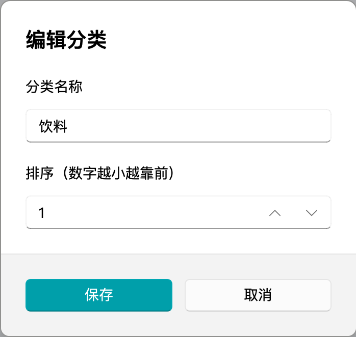
<figcaption>图：编辑分类对话框</figcaption>
</figure>

### 删除分类

点击「删除」按钮，确认后删除该分类。该分类下的商品会被自动移至「其他」分类。


## 进货管理（管理员）

进货管理采用简洁的**扫码驱动**流程，仅管理员可见。

<figure>
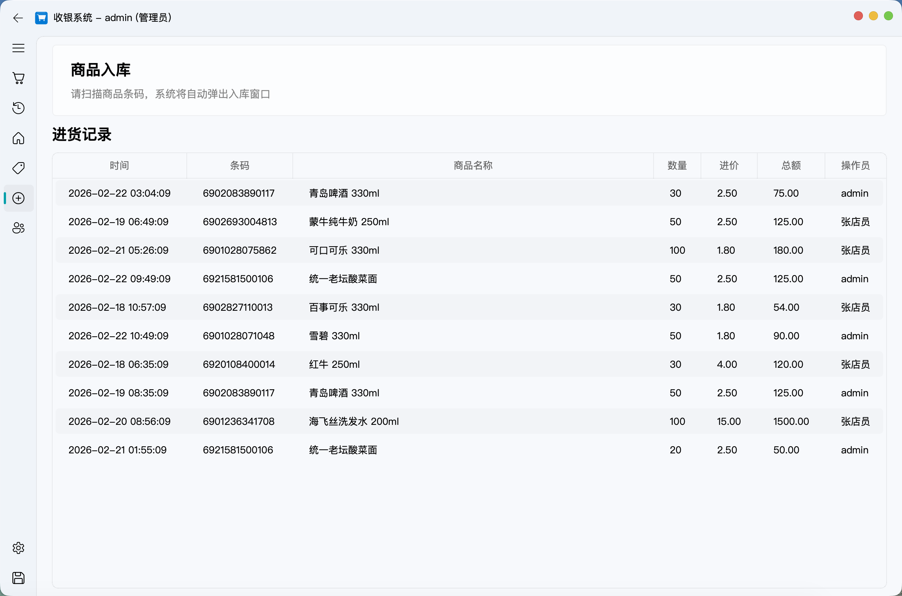
<figcaption>图：进货管理界面</figcaption>
</figure>

### 操作流程

1. 页面顶部显示操作提示：「请使用扫码枪扫描商品条码，系统将自动弹出入库窗口」
2. 使用扫码枪扫描商品条码
3. 系统自动查找商品：
   - **商品存在**：弹出入库对话框
   - **商品不存在**：显示红色错误提示「该商品不在商品库中，请先在商品管理中添加」

### 入库对话框

对话框顶部展示商品名称、条码、当前库存和售价，下方需要填写：

| 字段 | 是否必填 | 说明 |
|------|----------|------|
| 进货数量 | 必填 | 本次入库数量，默认 1 |
| 进货单价 | 选填 | 本次进价，默认使用上次进价 |
| 备注 | 选填 | 如供应商信息、批次号等 |

点击「确认入库」后：

- 商品库存自动增加相应数量
- 若填写了进货单价，商品进价会同步更新
- 进货记录保存到数据库（包含操作员信息）

### 进货记录

页面下半部分展示历史进货记录表格，列包括：时间、条码、商品名称、数量、进价、总额、操作员。


## 用户管理（管理员）

用户管理页面用于管理系统登录账号，仅管理员可见。

<figure>
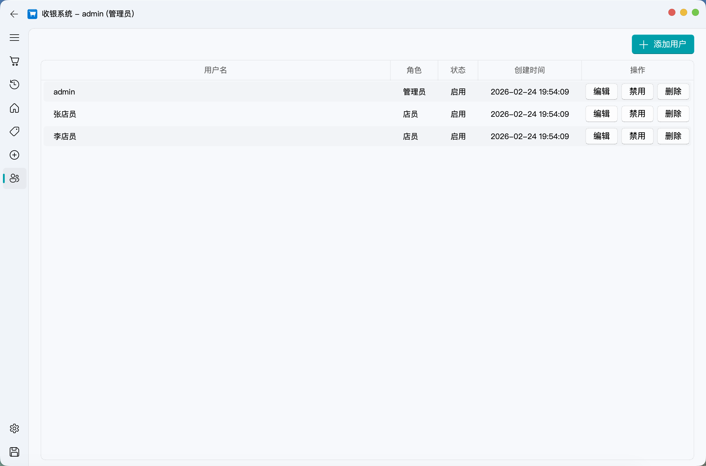
<figcaption>图：用户管理界面</figcaption>
</figure>

### 用户列表

列表展示所有用户，列包括：用户名、角色、状态、创建时间、操作。

### 角色说明

| 角色 | 权限 |
|------|------|
| 管理员 | 可访问全部功能（收银、销售记录、仪表盘、商品管理、进货管理、用户管理、支付设置、备份管理） |
| 店员 | 仅可访问收银和销售记录 |

### 添加用户

点击「添加用户」按钮，填写用户名、密码，并选择角色（店员 / 管理员），保存即可。

### 编辑用户

点击「编辑」按钮，可修改用户名、密码和角色。密码栏留空则不修改原密码。

### 禁用 / 启用用户

点击「禁用」按钮可将用户设为不活跃状态，被禁用的用户无法登录。点击「启用」可恢复。

### 删除用户

点击「删除」按钮，确认后**彻底删除**该用户。该用户的销售记录和进货记录会被一并删除（级联删除）。


## 支付设置（管理员）

支付设置页面用于配置微信支付和支付宝的接口参数，仅管理员可见。

<figure>
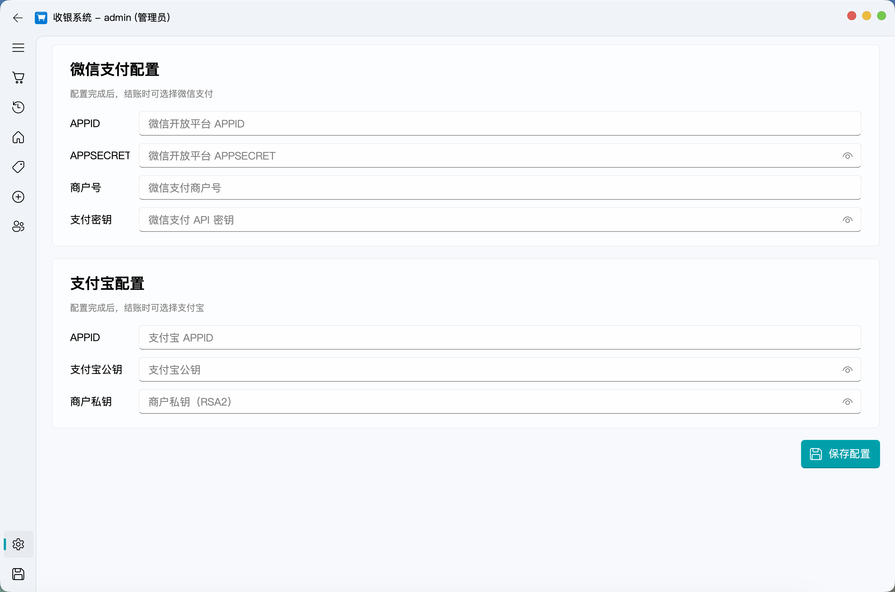
<figcaption>图：支付设置界面</figcaption>
</figure>

### 微信支付配置

| 字段 | 说明 |
|------|------|
| APPID | 微信开放平台 APPID |
| APPSECRET | 微信开放平台 APPSECRET |
| 商户号 | 微信支付商户号 |
| 支付密钥 | 微信支付 API 密钥 |

> 四个字段全部填写并保存后，结账时才会显示「微信支付」选项。

### 支付宝配置

| 字段 | 说明 |
|------|------|
| APPID | 支付宝应用 APPID |
| 支付宝公钥 | 支付宝公钥 |
| 商户私钥 | 商户 RSA2 私钥 |

> 三个字段全部填写并保存后，结账时才会显示「支付宝」选项。

### 注意事项

- 现金支付始终可用，无需配置
- 敏感信息（密钥、私钥）以密码框形式展示
- 配置保存在本地数据库的 `settings` 表中


## 备份管理（管理员）

备份管理页面提供完整的数据安全保障，仅管理员可见。

<figure>
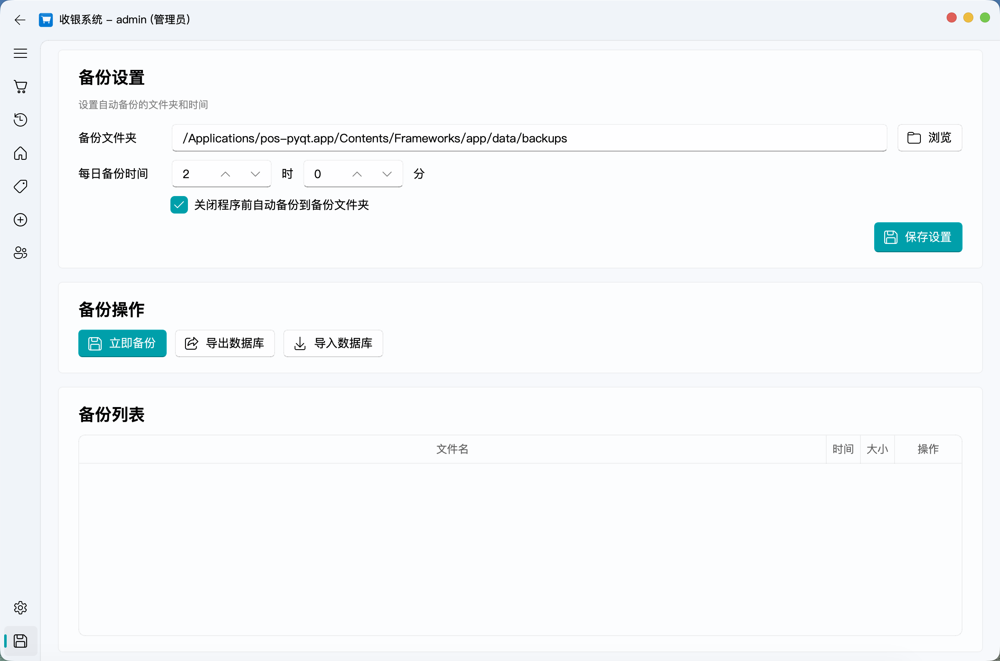
<figcaption>图：备份管理界面</figcaption>
</figure>

### 备份设置

| 设置项 | 默认值 | 说明 |
|--------|--------|------|
| 备份文件夹 | `app/data/backups/` | 备份文件存储位置，可自定义 |
| 每日备份时间 | 02:00 | 系统每天自动执行备份的时间（可精确到分钟） |
| 关闭前自动备份 | 开启 | 退出程序时自动备份当前数据库 |
| 备份保留数量 | 720 | 超出数量的旧备份将自动删除，可在 1 ~ 9999 之间调整 |

修改设置后点击「保存设置」生效。

### 备份操作

| 按钮 | 功能 |
|------|------|
| 立即备份 | 立刻创建一个手动备份 |
| 导出数据库 | 将当前数据库文件导出到指定位置（可用于传输到其他设备） |
| 导入数据库 | 选择外部数据库文件导入覆盖当前数据库（操作前自动创建备份） |
| 清除演示数据 | 一键删除所有演示交易记录、进货记录和非管理员用户，仅保留管理员账号和商品数据，将系统恢复为生产初始状态 |

### 清除演示数据

系统首次启动时会自动生成一批演示数据（包括 2 个店员账号、近 7 天的交易记录和进货记录），方便用户快速体验系统功能。当您准备将系统投入正式使用时，可点击「清除演示数据」按钮一键清除。

**清除范围：**

- 所有交易记录及其商品明细
- 所有进货记录
- 除管理员以外的所有用户（店员账号）

**保留内容：**

- 管理员账号
- 所有商品数据（名称、条码、价格、库存等）

> **建议**：在清除演示数据前，可先点击「立即备份」保存一份当前数据，以便需要时恢复。

### 备份列表

页面下方展示备份文件列表，显示文件名、创建时间和文件大小。点击「恢复」按钮可将数据回滚到该备份时的状态。

### 备份文件命名规则

| 前缀 | 来源 |
|------|------|
| `auto_` | 每日定时自动备份 |
| `manual_` | 手动点击「立即备份」 |
| `close_` | 关闭程序前的自动备份 |
| `import_` | 导入数据库前的自动备份 |

### 自动清理

系统默认保留最近 **720 个**备份文件，超出数量的旧备份会自动删除。可在备份设置中调整保留数量。

> **重要提示**：恢复或导入操作会覆盖当前数据库，完成后需要**重启程序**才能生效。


## 个人中心

点击左侧导航栏底部的**「个人中心」**即可进入个人中心页面，**管理员和店员均可使用**。

<figure>
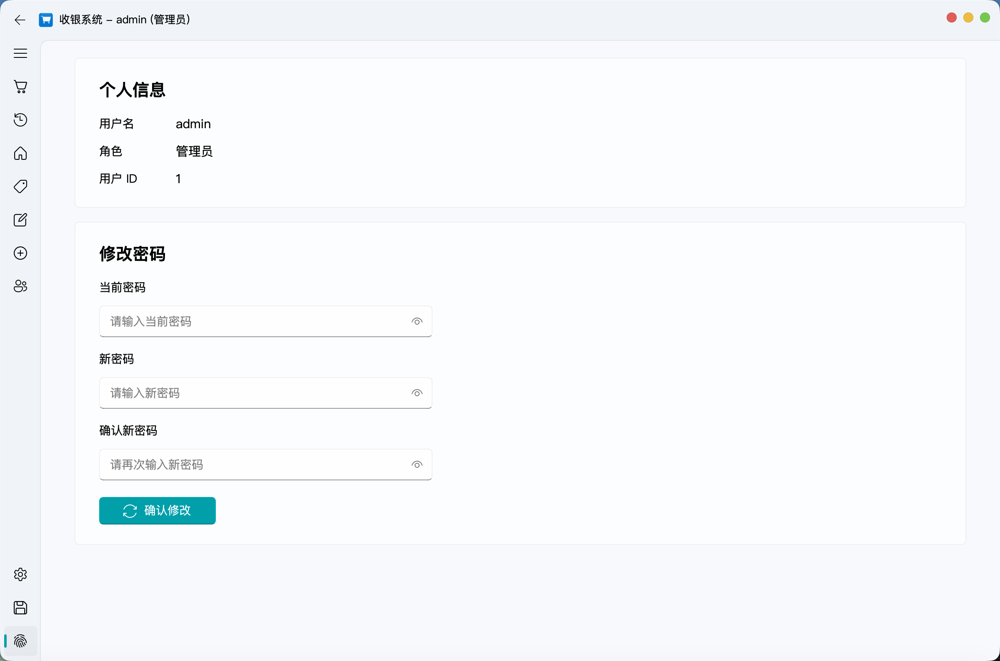
<figcaption>图：个人中心页面</figcaption>
</figure>

### 个人信息

页面上方卡片展示当前登录用户的基本信息：

- **用户名**：当前登录的账号名
- **角色**：管理员或店员
- **用户 ID**：系统内部用户编号

### 修改密码

页面下方卡片提供密码修改功能：

1. 输入**当前密码**进行身份验证
2. 输入**新密码**（不少于 4 位）
3. **再次输入新密码**确认一致
4. 点击「确认修改」按钮完成修改

> **提示**：修改密码后无需重新登录，当前会话继续有效。下次登录时需使用新密码。


## 权限说明

| 功能模块 | 管理员 | 店员 |
|----------|:------:|:----:|
| 收银 | 是 | 是 |
| 销售记录 | 是 | 是 |
| 仪表盘 | 是 | — |
| 商品管理 | 是 | — |
| 商品分类 | 是 | — |
| 进货管理 | 是 | — |
| 用户管理 | 是 | — |
| 支付设置 | 是 | — |
| 备份管理 | 是 | — |
| 个人中心 | 是 | 是 |


## 快捷键速查表

| 快捷键 | 所在页面 | 功能 |
|--------|----------|------|
| **F12** | 收银 | 打开结账对话框 |
| **F4** | 收银 | 打开整单折扣对话框 |
| **Delete** | 收银 / 销售记录 | 删除选中的商品或交易 |
| **Enter** | 登录 | 提交登录 |
| 条码 + **Enter** | 收银 / 商品管理 / 进货管理 | 扫码操作（全局监听） |


## 常见使用场景

### 场景一：日常收银

1. 店员登录系统，自动进入收银页面
2. 使用扫码枪逐一扫描顾客商品，购物车自动添加
3. 如需调整数量，点击 ＋/－ 按钮或双击商品行精确修改
4. 如有优惠活动，按 F4 设置整单折扣
5. 按 F12 结账，选择支付方式，完成交易
6. 系统自动清空购物车，准备服务下一位顾客

### 场景二：新商品上架

1. 管理员登录，进入商品管理页面
2. 使用扫码枪扫描新商品条码
3. 系统检测到该条码不存在，自动弹出添加对话框并预填条码
4. 填写商品名称、分类、售价等信息，保存
5. 切换到进货管理页面，扫码该商品进行首批入库

### 场景三：每日进货

1. 管理员登录，进入进货管理页面
2. 逐一扫描到货商品条码
3. 在弹出的入库对话框中输入进货数量和进价
4. 确认后库存自动增加
5. 所有进货记录自动保存在记录表中，便于后续核查

### 场景四：查看经营状况

1. 管理员登录，进入仪表盘页面
2. 查看今日和本月的销售数据
3. 通过柱状图了解近 7 天的营业额趋势
4. 通过饼图了解各分类的销售占比和支付方式分布
5. 查看热销商品排行和库存预警列表
6. 浏览最近交易列表快速了解销售动态

### 场景五：数据备份与恢复

1. 管理员进入备份管理页面
2. 确认自动备份设置（时间、文件夹、关闭前备份）
3. 如需手动备份，点击「立即备份」
4. 如需迁移到新设备，使用「导出数据库」
5. 如数据出现问题，从备份列表中选择合适的时间点点击「恢复」


## 常见问题与排查

### 扫码枪无法识别

**现象**：扫码后无任何反应。

**排查**：

- 确保扫码枪为 USB HID 模式（模拟键盘输入 + 回车后缀）
- 确保焦点不在文本输入框中（如搜索框、条码输入框等），否则扫码内容会输入到文本框中而非被系统全局捕获
- 点击页面空白区域使焦点脱离输入框后重试

### 支付宝/微信选项不显示

**现象**：结账时只有"现金"选项。

**排查**：

- 进入「支付设置」页面，确认所有字段已正确填写并保存
- 微信需填写 4 个字段（APPID、APPSECRET、商户号、支付密钥）
- 支付宝需填写 3 个字段（APPID、支付宝公钥、商户私钥）

### 超卖警告

**现象**：结账时提示库存不足。

**排查**：

- 如果「忽略库存」开关为开启状态，警告不会阻止操作，可以继续结账
- 如果需要严格管控库存，关闭「忽略库存」开关，此时库存不足会阻止结账
- 在进货管理中扫码补充库存

### 恢复备份后数据未更新

**现象**：恢复备份或导入数据库后，界面仍显示旧数据。

**排查**：

- 恢复/导入操作完成后必须**重启程序**才能生效
- 关闭程序后重新打开即可

### 购物车序号显示不全

**现象**：购物车商品超过 9 件后序号不显示。

**排查**：

- 此问题已在 v1.3.2 中修复。如遇此问题请升级到最新版本


## 技术参数

| 项目 | 参数 |
|------|------|
| 开发语言 | Python 3.8+ |
| UI 框架 | PyQt5 5.15 + PyQt-Fluent-Widgets 1.11 |
| 数据库 | SQLite（WAL 模式，支持外键约束） |
| 密码加密 | SHA-256 哈希 |
| 支持平台 | Windows (x64)、macOS (ARM64)、Linux (x64) |
| 最低兼容 | Windows 7 |
| 默认窗口大小 | 1200 × 800 像素 |
| 最小窗口大小 | 960 × 640 像素 |
| 备份保留数量 | 默认 720 个（可配置） |
| 自动备份检查间隔 | 60 秒 |
| 扫码缓冲超时 | 100 毫秒 |
| 项目地址 | [https://github.com/zhiqing0205/pos-pyqt](https://github.com/zhiqing0205/pos-pyqt) |
